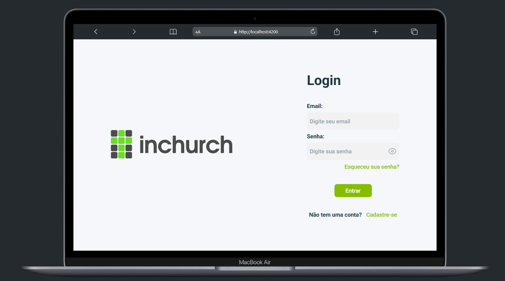
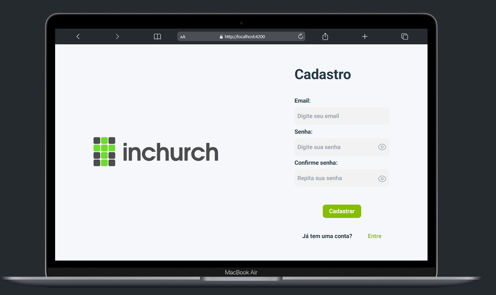
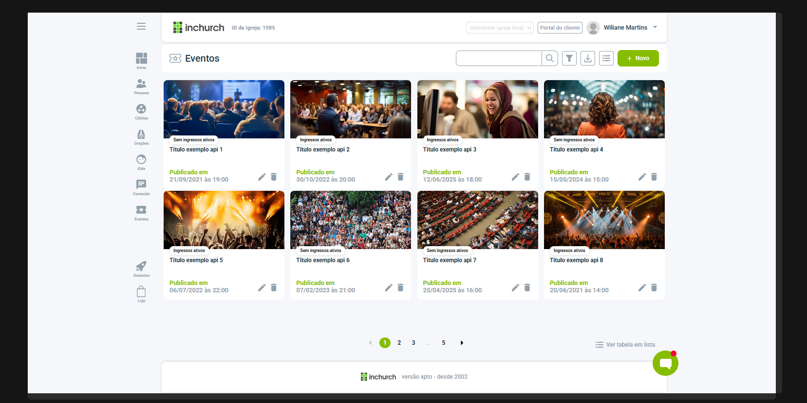
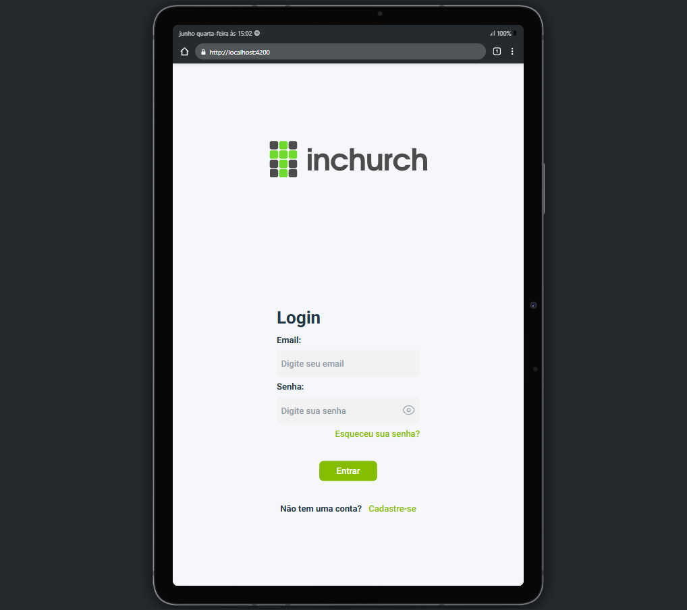
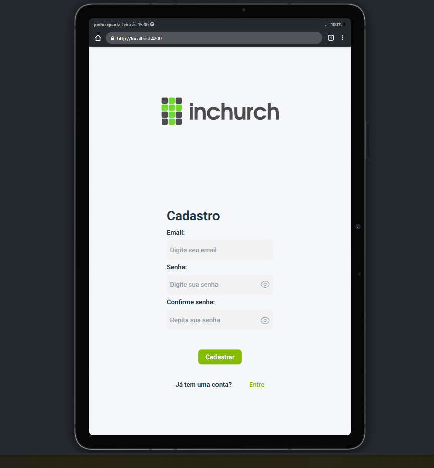
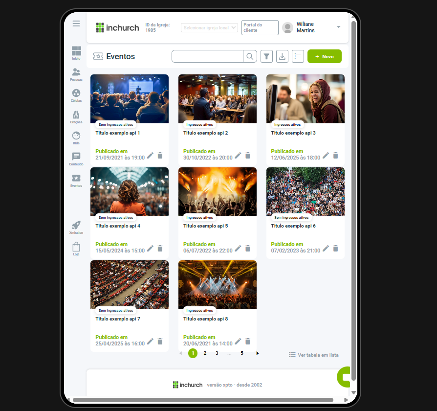
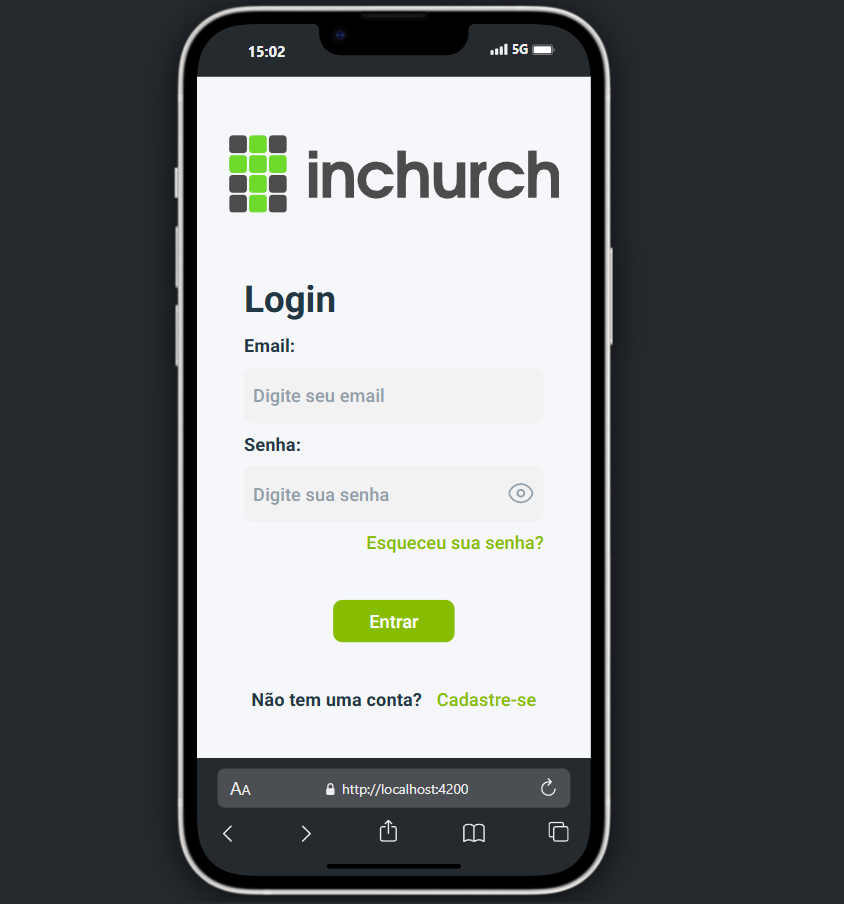
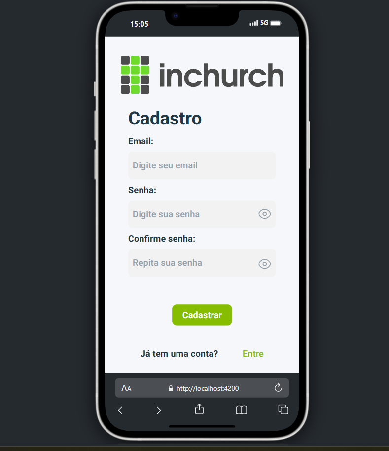
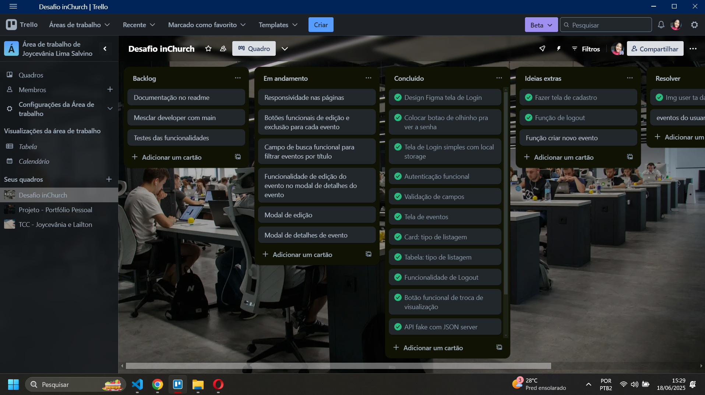
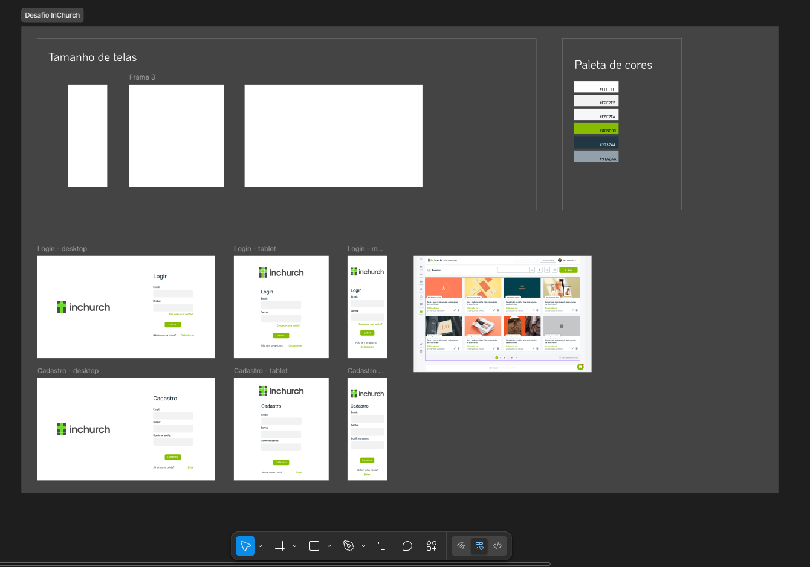

# desafio-tecnico_inchurch_desenvolvedor-front-end
Este desafio tem como objetivo avaliar habilidades com Angular e desenvolvimento de interfaces responsivas. O desafio consiste em implementar um sistema para gerenciamento de eventos, incluindo funcionalidades de listagem, visualização em detalhes, e um sistema de login simples.

## Funcionalidades
- Login com autenticação completa;
- Funcionalidade de Logout;
- Cadastro de usuário;
- validação de campos;
- Visualização em Card e em Tabela na aba de Eventos;
- Botão funcional para troca de visualização
- API fake com JSON server;
- Layout totalmente responsivo nas telas de Login e cadastro (as demais estão parcialmente);
- Toasts de sucess, error, info e warning quando realiza login, cadastro e nas verificações de campos, se já existe usuário e demais funcões;
- Paginação de eventos.

## Responsividade mobile, tablet e desktop

### Desktop 

 
 

### Tablet 
&nbsp;&nbsp;
&nbsp;&nbsp;
&nbsp;&nbsp;

### Mobile 
&nbsp;&nbsp;
&nbsp;&nbsp;

## Vale destacar 

### Foram utilizado o Trello, para gerenciamento de tarefas com Kanban com mais eficiência e organização, e o Figma para desenhar o layout das telas de Login de Cadastro.

## Requisitos para rodar o projeto

- Node.js
- Npm
- Angular
- json-server

### Para rodar o projeto
1. Clone este repositório [https://github.com/joycevaniasalvino/desafio-tecnico_inchurch_desenvolvedor-front-end.git](https://github.com/joycevaniasalvino/desafio-tecnico_inchurch_desenvolvedor-front-end.git);
2. Entre na pasta do projeto e execute no terminal o comando `npx json-server db.json` para instalar executar a api fake;
3. Em outro terminal, execute o comando `npm install` para instalar dependências do projeto;
4. Execute o comando `npm run start` para executar o projeto Angular;

